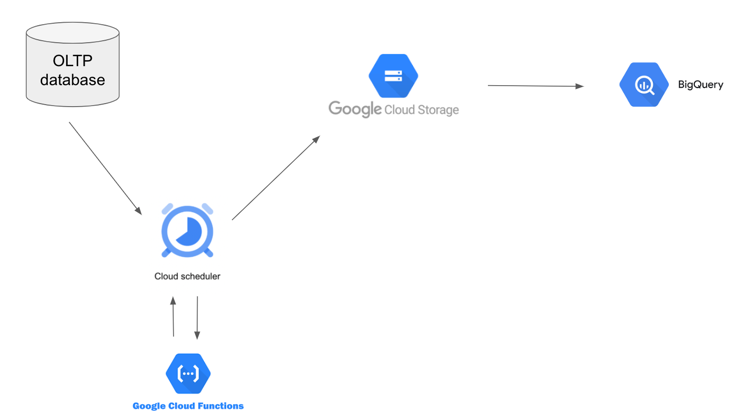

# Technical Interview as Data Engineer candidate

## Context
I am pleased to introduce you my assignment.
I have considered that "OurMedia" and "Brut" was the same entity.

You will find eight files in this folder :
- 2022-Technical Interview_DE.pdf : the subject of the assignment
- app.py : the code for the Flask API
- database.db : the sqlite database of the API 
- init_db.py : the script to initialise the API database
- readme.md : this file 
- schema.sql : the sql file that is used to initialise the API database
- tasks.py : the file with all answers to the tasks part
- test_app.py : test file for the API.

## To execute Tasks 1 to 4
- Initialise database with :
`python init_db.py database.db`
- Launch the API with :
`flask run`
- In another terminal, launch all tasks with :
`python tasks.py`
## To execute tests
You just need to lauch test file with :
`python test_app.py`

## Improvements on API
I've made the choice to not use SQLAlchemy ORM because i thought it would be easier for small app.
I am not sure it was the right choice.
I could have returned more precise error messages for payloads errors with specific status code.
All of this could have been tested more precisely.
Only needed endpoints have been created, for instance i have not created any GET methods. 
It would be better if i had added GET, POST and DELETE methods for each models.

## Task 5
For each table of the OLTP database, we should add an updated_at column to be able to track row changes.
Then, we create python functions in Google Cloud Functions that are scheduled with Cloud Scheduler each night. 
Functions :
- are retrieving rows from the day before based on updated_at column,
- put those rows in a csv (one csv per table),
- load csv files in Google Cloud Storage
- and make Big Query loading files in tables.

Saphia Benmansour
